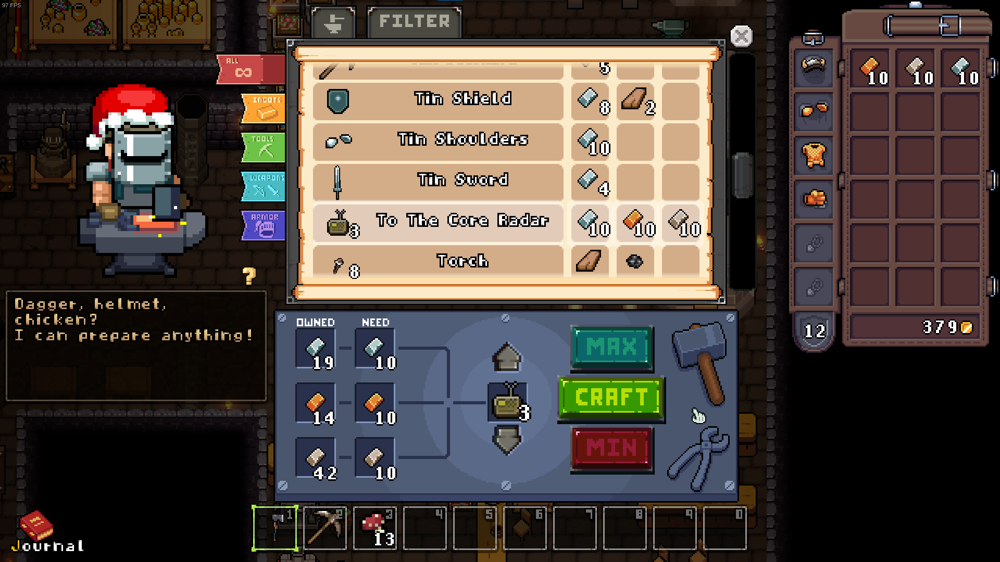
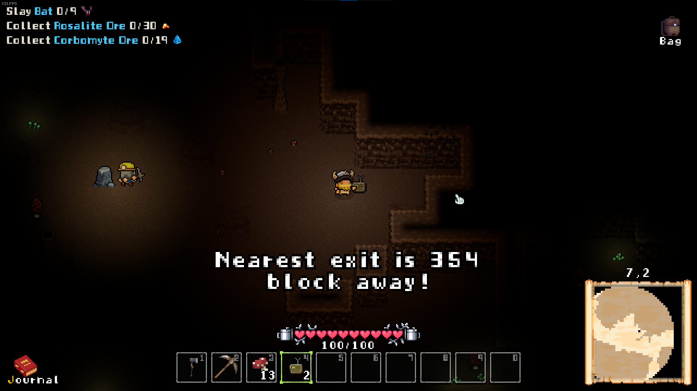

# To The Core

Adds a radar item that shows the nearest exit to the player.
Crafted with 10 tin, 10 copper and 10 iron.






## Installation

This mod requires BepInEx to work, it's a modding framework that allows multiple mods being loaded. Furthermore, Harmony is used to patch into the game, which means no game code is distributed and allows multiple mods to change it interdependent.

1. Download BepInEx from https://github.com/BepInEx/BepInEx/releases
2. Extract all files to your Below The Stone folder. It should look like this:\
   
3. Optional: start the game once. Afterwards you will see a config file in BepInEx/config/ called `BepInEx.cfg`. Open it and set `Enabled = true` under `[Logging.Console]` to see loaded mods and errors immediately.
4. Download this mod from [Releases](https://github.com/MSchmoecker/ToTheCore/releases) and extract it into BepInEx/plugins/
5. Launch the game!


## Development

1. Install BepInEx
2. Create a file called `Environment.props` in the root folder (one folder above the ToTheCore.csproj file) and add the following content:
   ```xml
   <?xml version="1.0" encoding="utf-8"?>
   <Project ToolsVersion="Current" xmlns="http://schemas.microsoft.com/developer/msbuild/2003">
       <PropertyGroup>
           <BELOW_THE_STONE_INSTALL>C:/Program Files/Steam/steamapps/common/Below The Stone</BELOW_THE_STONE_INSTALL>
           <MOD_DEPLOYPATH>$(BELOW_THE_STONE_INSTALL)/BepInEx/plugins</MOD_DEPLOYPATH>
       </PropertyGroup>
   </Project>
   ```
3. Compile the project. This copies the resulting dll into the `MOD_DEPLOYPATH`, if set
4. To change assets, open the Unity project and adjust the files. Afterwards, open the Asset Bundle Browser and rebuild the asset bundle. When compiling the project, the asset bundle will be copied into the project folder


## Changelog

0.2.0
- Changed the radar text to only show the distance, not the exact direction
- Changed the recipe to require 10 ingots each, with a resulting stack size of 3

0.1.0
- Release
